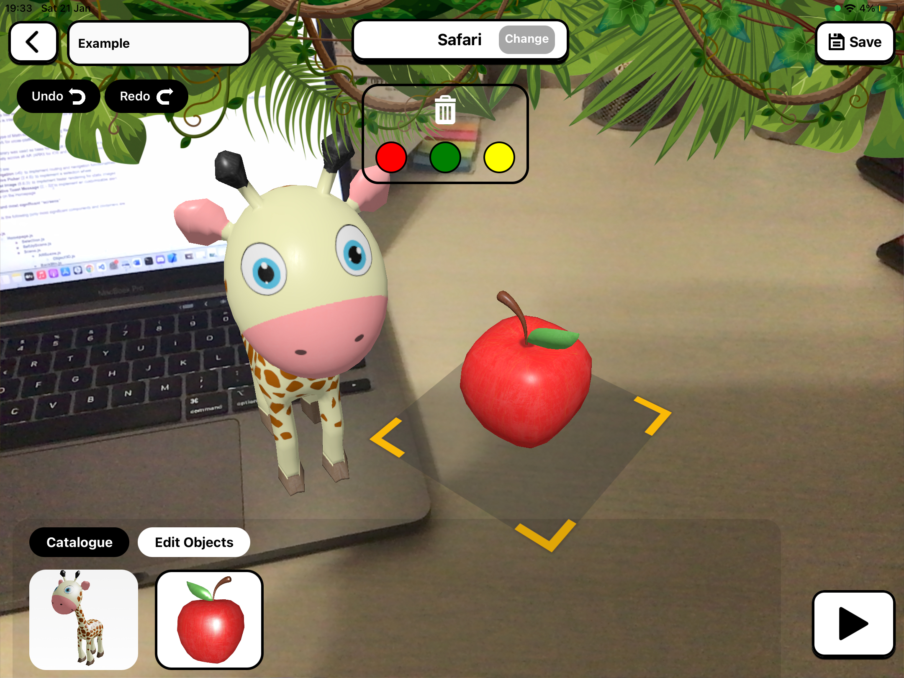

# Math-ilo tu!

> ⚠️ NOTE: The android emulators and iOS simulators are not supported by Viro. Please test on the real devices! See [this](https://viro-community.readme.io/docs/frequently-asked-questions#does-this-work-with-ios-simulators-or-android-emulators).

    
    

## Group Repository

Final Report for Math-ilo Tu! can be found [here](./Report.pdf).

## Requirements

1. iPad with at least iOS 11 and A7 chip.
2. A MacBook with XCode >= 13.4 + USB to Lighting cable
3. Node v14.18.1

## Installation

1. `git clone https://github.com/polito-hci-2022/Math-ilo-tu-.git`
2. `nvm install 14.18.1` (optional)
3. `npm i`
4. `npx pod-install`
5. `Open ios/myviroapp.xcworkspace on xCode, connect iPad`
6. `Change Team Signing & Build Phase node version`
7. `Run`
